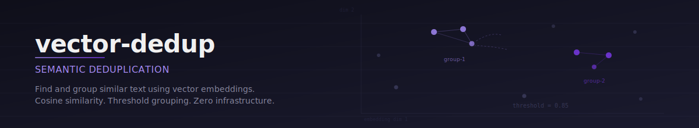
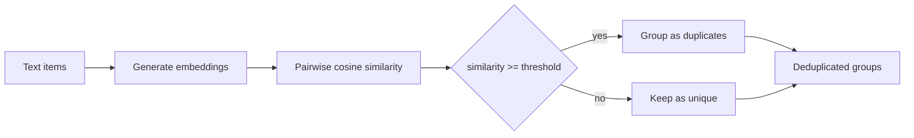

# vector-dedup

<p align="center">
  
</p>

<p align="center">
  Semantic deduplication using vector embeddings.<br/>
  Feed in text items with near-duplicates. Get back clean, grouped representatives.
</p>

<p align="center">
  <a href="https://github.com/protectyr-labs/vector-dedup/actions/workflows/ci.yml"></a>
  <a href="./LICENSE"></a>
  <a href="https://www.typescriptlang.org/"></a>
  <a href="https://www.npmjs.com/package/@protectyr-labs/vector-dedup"></a>
</p>

---

## Quick start

```bash
npm install @protectyr-labs/vector-dedup
```

```typescript
import { groupByThreshold, findSimilar } from '@protectyr-labs/vector-dedup';

const items = [
  { id: 'ticket-1', embedding: [0.12, 0.85, 0.33] },  // "Cannot log in"
  { id: 'ticket-2', embedding: [0.11, 0.86, 0.32] },  // "Login page broken"
  { id: 'ticket-3', embedding: [0.92, 0.05, 0.41] },  // "Export to CSV"
];

const groups = groupByThreshold(items, 0.85);
// [
//   { canonical: 'ticket-1', duplicates: ['ticket-2'] },
//   { canonical: 'ticket-3', duplicates: [] }
// ]

const similar = findSimilar([0.13, 0.84, 0.34], items, 0.7, 5);
// [{ id: 'ticket-1', similarity: 0.98 }, { id: 'ticket-2', similarity: 0.97 }]
```

### With OpenAI embeddings

```typescript
import { deduplicate } from '@protectyr-labs/vector-dedup';

// Requires OPENAI_API_KEY
const groups = await deduplicate([
  { id: '1', text: 'Cannot log in to my account' },
  { id: '2', text: 'Login page is broken' },
  { id: '3', text: 'How do I export data to CSV?' },
], { threshold: 0.85 });

// [{ canonical: '1', duplicates: ['2'] }, { canonical: '3', duplicates: [] }]
```

## How it works



Each text item is mapped to a vector in embedding space. Items whose vectors point in nearly the same direction (cosine similarity above a threshold) are grouped together. The first item in each group becomes the canonical representative; the rest are marked as duplicates.

## Why this exists

100 support tickets come in. 30 are the same issue worded differently. This library groups them by semantic similarity so you process each issue once instead of thirty times.

The core functions (`cosineSimilarity`, `groupByThreshold`, `findSimilar`) are pure math with zero dependencies. They work with embeddings from any provider. The optional `deduplicate()` wrapper calls OpenAI to handle the embedding step for you.

## Use cases

**Support ticket deduplication** -- 100 tickets arrive. 30 describe the same issue in different words. Group them by semantic similarity to reduce duplicate work.

**Knowledge base maintenance** -- Before adding a new article, check if a semantically similar one already exists. Merge instead of duplicating.

**Document clustering for RAG** -- Before feeding documents to a retrieval pipeline, deduplicate to avoid returning multiple copies of the same content.

## API

| Function | Description |
|----------|-------------|
| `cosineSimilarity(a, b)` | Cosine similarity between two vectors (-1 to 1) |
| `groupByThreshold(items, threshold?)` | Group items by similarity (default 0.85) |
| `findSimilar(query, items, threshold?, limit?)` | Semantic search (default threshold 0.7, limit 10) |
| `generateEmbedding(text, model?, dims?)` | OpenAI embedding generation |
| `deduplicate(items, options?)` | High-level: embed + group in one call |

## Design decisions

**Why 0.85 default threshold?** Empirically tested across support ticket datasets. Below 0.80, false positives increase sharply ("password reset" matches "account deletion"). Above 0.90, legitimate paraphrases get missed. The 0.85 default catches paraphrases ("can't log in" / "login broken") while keeping distinct topics separate. Adjust down to 0.75 for aggressive dedup or up to 0.92 for conservative dedup.

**Why cosine similarity over euclidean distance?** Cosine measures direction, not magnitude. Two vectors pointing the same way score 1.0 regardless of length, which matches how embedding models encode meaning. The 0-to-1 range for normalized embeddings makes thresholds intuitive. OpenAI, Cohere, and most providers recommend cosine for their models.

**Why in-memory by default?** Most batch dedup jobs process fewer than 1,000 items, where O(n^2) comparison completes in milliseconds. For 10K+ items, use pgvector or a similar vector database for approximate nearest neighbor search, and use `cosineSimilarity()` as your scoring function.

**Why OpenAI for embeddings?** Cost and quality. `text-embedding-3-small` costs $0.02 per 1M tokens -- a batch of 1,000 tickets runs for roughly $0.001. The dependency is optional; all core functions accept pre-computed embeddings from any provider.

## Limitations

- **O(n^2) grouping** -- fine for fewer than 1K items; use pgvector for 10K+
- **OpenAI required for text input** -- pure functions work without it, but `deduplicate()` needs an API key
- **Single-model embeddings** -- do not mix embeddings from different models in the same call
- **Greedy assignment** -- items join the first matching group; different input order can produce different groupings
- **No incremental updates** -- adding a new item requires re-running the full grouping

> [!NOTE]
> For large-scale deduplication (10K+ items), pair `cosineSimilarity()` with a proper vector index like pgvector or Pinecone for candidate retrieval. This library targets the common case of batch dedup under 1,000 items.

## Origin

Built at [Protectyr Labs](https://github.com/protectyr-labs) as internal tooling for cleaning up support ticket and knowledge base pipelines. Extracted as a standalone library because the pattern -- embed, compare, group -- comes up in every project that deals with unstructured text.

## See also

- [file-preprocess](https://github.com/protectyr-labs/file-preprocess) -- extract text from files before embedding
- [token-budget](https://github.com/protectyr-labs/token-budget) -- budget deduplicated chunks into your prompt

## License

MIT
